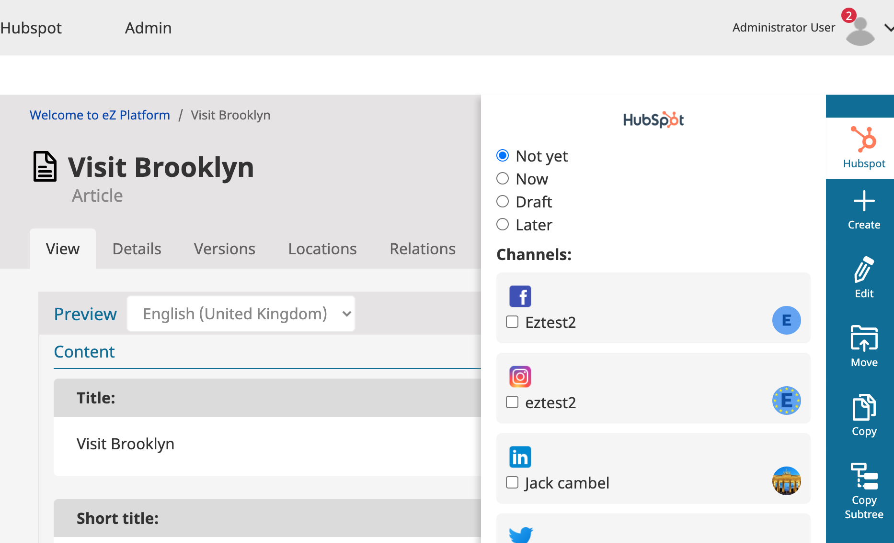

# EzPlatform Hubspot Bundle

Share your content to social media via Hubspot.

## Features

This bundle supports and was tested with below providers

- `Facebook`
- `Twitter`
- `Instagram`
- `LinkedIn` 

## Usage and installation instructions

[Installation](doc/install.md)

[Usage](doc/usage.md)

[Extend](doc/extend.md)

[Changelog](doc/changelog.md)

[License](LICENSE)

## How it works
click image below to watch the youtube video
 

## TODO
- Refactoring improvements
- Cache Handler for add and delete records

